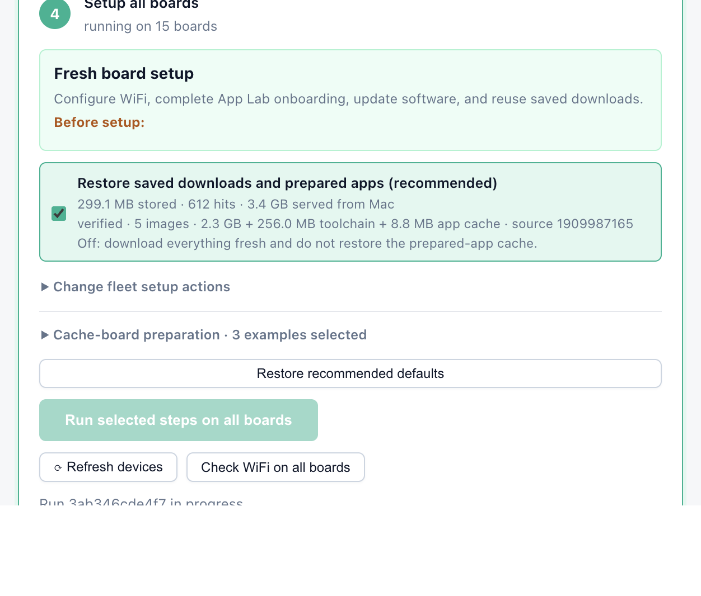
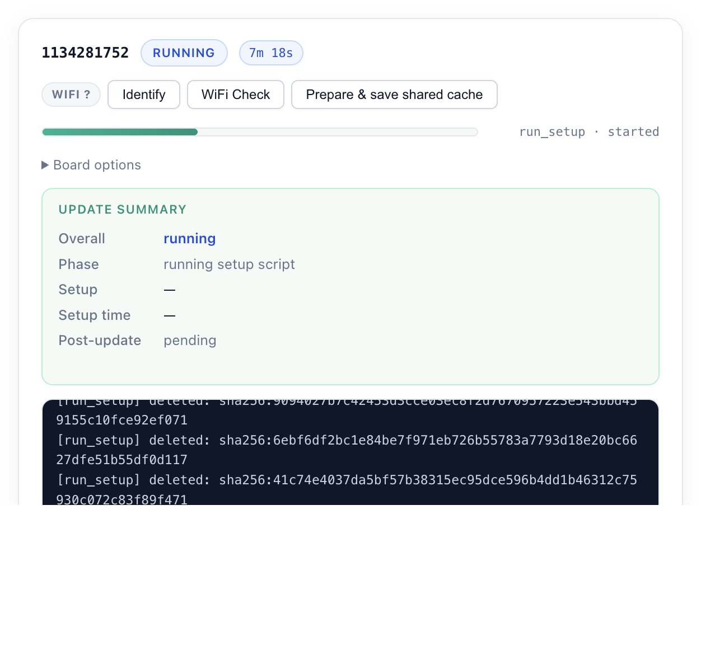
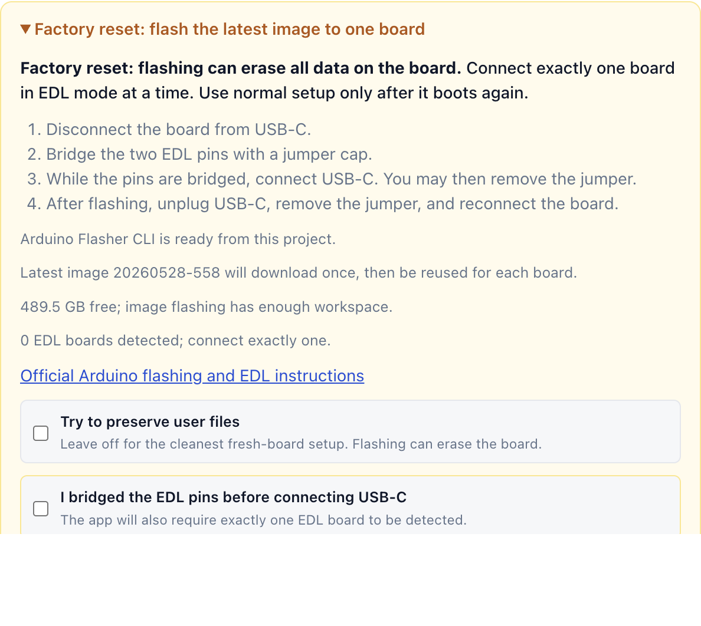

# Arduino UNO Q Flasher (Web UI)

A web app that prepares multiple Arduino UNO Q boards in parallel over `adb`,
with a separate guarded recovery workflow for flashing the latest Linux image.
It provides live per-device logs and replaces the original shell workflow.

The normal setup path is non-destructive: it configures an already bootable
board, updates Arduino packages, restores reusable workshop assets, and verifies
App Lab. The image-recovery path is separate, guarded, and operates on exactly
one board in Emergency Download Mode (EDL).

## Screenshots

### Fleet setup



*Choose the setup actions and launch all connected boards from one control.*

### Live board progress



*Each board has independent progress, diagnostics, logs, and cache controls.*

### Guarded image recovery



*Image recovery requires an explicit EDL confirmation and exactly one detected board.*

## Contents

- [Screenshots](#screenshots)
- [Prerequisites](#prerequisites)
- [Install and run](#install-and-run)
- [Configuration](#configuration)
- [Using the UI](#using-the-ui)
- [Restore the latest board image](#restore-the-latest-board-image)
- [Caches](#caches)
- [Offline Edge LLM model deployment](#offline-edge-llm-model-deployment)
- [Workflow stages](#workflow-stages)
- [Retries and run state](#retries-and-run-state)
- [Troubleshooting](#troubleshooting)
- [HTTP API](#http-api)
- [Standalone scripts](#standalone-scripts)
- [Parallelism and fleet sizing](#parallelism-and-fleet-sizing)

## Prerequisites

### Hardware

* [Amazon Basics 10 Port USB A Hub](https://www.amazon.es/-/en/Amazon-Basics-10-Port-Power-Adapter/dp/B076YRSWGW)
* 10 USB-A to USB-C cables

### Software

- **Python 3.11+** (the project currently reports version `0.1.0`)
- **adb** (Android platform-tools) on your `PATH`
  - macOS: `brew install android-platform-tools`
  - Windows: download from <https://developer.android.com/studio/releases/platform-tools>
  - Linux: `sudo apt install adb`
- **`unoq-setup.sh`** present at the project root (pushed to each device).
- A booted UNO Q with USB debugging available for normal setup. `adb devices`
   must show it in the `device` state, not `offline` or `unauthorized`.
- **`.env`** at the project root, normally created from the UI. WiFi values are
   required when the `run_setup` stage is enabled.
- **`properties.msgpack`** at the project root or top level of the chosen app
   folder. The recommended fresh-board setup requires it and pushes it to:
   - `/var/lib/arduino-app-cli/properties.msgpack` (App Lab's active state)
  - `/home/arduino/.local/share/arduino-app-cli/properties.msgpack`
  - `/tmp/properties.msgpack`

The bundled `tools/arduino-flasher-cli/arduino-flasher-cli` is for Apple
Silicon macOS. Linux and other macOS architectures must provide a compatible
`arduino-flasher-cli` on `PATH`. EDL detection is supported on macOS and Linux;
the recovery workflow is not currently supported on Windows.

## Install and run

```bash
# Ensure Python 3.11+ is used for the venv (required by this project).
# macOS (Homebrew) if missing: brew install python@3.11
python3.11 -m venv .venv
# Windows:
.venv\Scripts\activate
# macOS/Linux:
source .venv/bin/activate

# Optional but recommended: modern editable-install support
python -m pip install --upgrade pip
pip install -e .
python -m app
```

Open <http://localhost:8000>.

The server binds to `127.0.0.1`, not the LAN. Keep the terminal open while a
run is active. For a quick readiness check:

```bash
curl http://127.0.0.1:8000/api/health
adb devices
```

The health response reports ADB, required local files, settings presence, and
both cache states. It does not prove that a particular board can reach WiFi or
that all target-side services are healthy; use **WiFi check** or a setup run for
those checks.

## Configuration

The UI writes these managed keys to the project-root `.env` file:

```dotenv
UNOQ_WIFI_SSID=your-network
UNOQ_WIFI_PASSWORD=your-wifi-password
UNOQ_DEFAULT_PASSWORD=your-new-board-password
```

| Variable | Required | Meaning |
| --- | --- | --- |
| `UNOQ_WIFI_SSID` | For setup | WiFi network configured on the board. |
| `UNOQ_WIFI_PASSWORD` | For setup | WiFi password. |
| `UNOQ_DEFAULT_PASSWORD` | Optional | Desired password for the `arduino` user and a sudo candidate. |
| `UNOQ_UPDATE_TIMEOUT_SECONDS` | Optional | `arduino-app-cli system update` timeout; defaults to 2700 seconds (45 minutes). |
| `UNOQ_FORCE_CLEANUP` | Optional | Set to `1` to prune container data even when at least 1 GB is free. |

The app injects two internal values for each run; users normally must not put
them in `.env`:

- `UNOQ_HOST_EPOCH` synchronizes a fresh board's clock before repository
   signature checks. Ensure the host clock is correct.
- `UNOQ_APT_CACHE_URL` points the board at the per-device USB package-cache
   tunnel when package caching is enabled.

`.env` is plaintext and the local settings API returns its managed values so
the UI can edit and reveal them. Run the app only on a trusted account and do
not commit `.env`.

## Using the UI

1. Enter the WiFi credentials and click **Save**. They are stored in the local
   project `.env` file for later sessions.
2. Connect the UNO Q boards over USB-C. They appear automatically within five
   seconds; **Identify** blinks one board's red LED when cables need tracing.
3. Leave the recommended defaults enabled and click **Run selected steps on all
   boards**. This configures WiFi, marks onboarding complete, updates App Lab,
   and restores locally cached downloads.
4. Choose an app folder only when the boards need a custom app. The staged copy
   remains available for 24 hours and is restored after browser or app reloads.
   App-folder deployment stays off until explicitly enabled in the same step;
   there is no second deployment toggle under Run.
5. Optional post-update commands have their own step after the app folder. They
   remain off unless **Run commands after setup** is enabled.
6. Each device card shows:
   - status badge (idle / running / success / failed)
   - progress bar across the workflow stages (selected steps show as run,
     skipped ones are marked skipped)
   - live-tailing log panel
7. If a device fails, correct the reported problem and click **Retry**. Retry
   starts only that board and reuses the original run settings; it does not
   restart the other connected boards.

Run choices, post-update commands, selected examples, and the current staged
app folder are restored after a browser reload. Passwords are not stored in
browser storage. Run events are held in server memory and survive browser
reloads, but not an app-server restart. Staged uploads are reusable for 24 hours
and old upload directories are swept when the server starts.

The recommended cache-board preset prepares **Blink LED**, **Real-time
Accelerometer**, and **Edge AI Assistant**. Resetting to recommended setup
restores those selections without enabling app-folder deployment.

## Restore the latest board image

Image recovery is separate from normal ADB setup and is intentionally limited
to one board at a time because the official CLI has no target-selection flag.
The repository includes Arduino's official Apple Silicon
`arduino-flasher-cli` v0.5.3 executable under `tools/`; the app uses it directly
without a system-wide installation. Other platforms can provide a compatible
`arduino-flasher-cli` on `PATH`.

The board must enter Emergency Download Mode (EDL): disconnect it, bridge the
two EDL pins, and connect USB-C while they are bridged. The app will not start
unless exactly one Qualcomm `05c6:9008` EDL device is detected and the operator
confirms the bridge procedure. A clean flash can erase user data, needs roughly
8 GB of temporary host space, and may download about 1 GB. The first flash
stores the checksum-verified latest image under `.cache/flasher-images/`;
subsequent boards reuse it. Each board still requires the EDL bridge procedure
and confirmation. Operations have a 45-minute limit and can be canceled. After
success, disconnect USB-C, remove the bridge, and reconnect the board normally.

## Caches

### Package cache

Package downloads are routed over USB through the host cache on
`127.0.0.1:3142`. The app creates one `adb reverse` tunnel per board, so the
board does not need LAN access to the host. Only the configured Debian and
Arduino package repositories are accepted.

Downloaded payloads are stored under `.cache/packages/`; concurrent requests
for the same URL are coalesced. Repository metadata files (`InRelease`,
`Release`, and `Release.gpg`) refresh after five minutes. If a refresh fails,
an existing cached response can be served as stale. The original APT source
files are restored after setup, including failure paths.

### Workshop cache

Use **Prepare & save shared cache** on exactly one prepared board. The warm-cache
run can start and stop selected examples or an uploaded app, then captures:

- tagged Docker images;
- Arduino toolchain data;
- prepared App Lab/example runtime caches; and
- package URLs downloaded while warming the board.

Artifacts are stored under `.cache/workshop/`. This is a reusable checkpoint,
not a raw disk image. Captures are transactional: every archive and SHA-256
manifest is verified before replacing the prior checkpoint, and a failed
capture leaves the previous verified cache intact. Per-board marker files avoid
retransferring artifacts that are already installed.

Use the UI verification control or `POST /api/cache/verify` to check integrity.
If a run reports a damaged workshop cache, warm and capture it again. To reset
manually while the server is stopped, remove `.cache/workshop/`; the next run
will proceed without those saved artifacts until a new cache is captured.

## Offline Edge LLM model deployment

The App Lab **Chat with a Local LLM** example uses
`llamacpp:Qwen3.5-0.8B-Q4_0` (507 MB). Export it once from a board where App Lab
has installed the model:

```bash
chmod +x export-edge-llm-model.sh
./export-edge-llm-model.sh SOURCE_BOARD_SERIAL
```

This creates the ignored local bundle `model-bundles/llamacpp/`, containing the
GGUF and `models.ini`. Export validates the GGUF at exactly 507,154,688 bytes;
an incomplete source model fails instead of creating a usable bundle. Both the
web flasher and `uno-q-update.sh` automatically
push this bundle to `/var/lib/arduino-app-cli/models/` after the system update.
App Lab then recognizes the model as installed without downloading it on each
board. The deployment does not start the LLM example.

## Workflow stages

Advanced options expose the complete per-board workflow. Optional stages can
be disabled per board, but keep their dependencies together: `run_setup` needs
the script push and executable-bit stages; `push_app` needs a staged upload;
uploaded-app preparation needs both an upload and one-board warm-cache mode.

1. `push_setup_script` — push `unoq-setup.sh` to `/home/arduino/.unoq-setup.sh`
2. `push_env` — push `.env` (if present locally)
3. `chmod_script` — make the setup script executable
4. `change_password` — set the arduino user's password from `UNOQ_DEFAULT_PASSWORD`
   (skippable; handles the "already-changed" case gracefully)
5. `push_properties` — install and verify `properties.msgpack` in the system,
   user, and temporary App Lab paths
6. `run_setup` — execute the remote setup script (WiFi, DNS, system update),
   then restore `model-bundles/` when present
7. `prune_docker_images` — optional cleanup of unused Docker/Podman images and
   stopped containers before post-update (disabled by default)
8. `restore_workshop_cache` — restore verified Docker and app-runtime caches
9. `push_app` — push the chosen folder to `/home/arduino/ArduinoApps/`
10. `prepare_uploaded_app` / `prepare_examples` — cache-board-only start/stop
11. `post_update` — run configured workshop preparation commands in order;
   any failure marks the board failed
12. `verify_ready` — require a responsive App Lab CLI/daemon, populated assets,
   a working Docker daemon, sufficient free disk, and the bundled model
13. `capture_cache` — save and verify warmed artifacts after a cache-board run

During `run_setup`, the board:

1. loads `.env`, synchronizes time, enables WiFi, and verifies DNS;
2. checks the optional USB package cache and temporarily rewrites matching APT
    sources;
3. frees disk space when needed, repairs interrupted package state, and handles
    the known broken `alsa-ucm-conf` package state;
4. runs the Arduino-only system update with a 45-minute default timeout and up
    to three attempts for the recognized no-internet failure;
5. restores original APT sources and verifies the App Lab daemon; and
6. prints a structured success/failure summary consumed by the UI.

The update timeout is initialized before both the remediation and normal update
paths. A message such as `timeout: invalid time interval ''` indicates an older
copy of `unoq-setup.sh`; restart the app from this checkout and retry the failed
board so the current script is pushed.

## Retries and run state

- **Retry is board-scoped.** The endpoint is
   `POST /api/runs/{run_id}/devices/{serial}/retry`; it does not create a new
   fleet run.
- Retry uses the original app folder, cache, post-update command, and other run
   context. Optional `skip_stages` may be supplied in the request body.
- A staged app must still exist. If its 24-hour staging data is unavailable,
   upload it again and create a new run.
- The server rejects or ignores overlapping work for a board already running.
   Wait for its terminal state before retrying again.
- The event WebSocket replays prior events before live events. Automation must
   locate the newest `device_started` for the target serial rather than treating
   an old replayed event as a new attempt.
- A recognized WiFi setup failure gets one automatic device-level retry. That
   retry forces a fresh `.env` push. Other failure classes require an operator
   retry.

## Troubleshooting

### Board is absent or offline

Run `adb devices`. Reconnect the USB cable, avoid charge-only cables, and accept
any authorization prompt. The UI refreshes discovery every few seconds. Use
**Identify** to blink the red user LED for about five seconds; images with
different LED sysfs paths or permissions return diagnostics instead.

### WiFi or DNS failure

Confirm `UNOQ_WIFI_SSID` and `UNOQ_WIFI_PASSWORD`, then use the board's **WiFi
check** action. It reports NetworkManager state, DNS resolution, and HTTPS reachability
to `downloads.arduino.cc`. Correct credentials or signal strength and retry only
the failed board.

### Password change warning

Password change is intentionally non-fatal because a board may already have
the requested password. The flasher tries the configured password and the
factory `arduino` password as sudo/current-password candidates. If setup later
reports that sudo is unavailable, set `UNOQ_DEFAULT_PASSWORD` to the board's
current usable password or reflash the board.

### System update failure

- `timeout: invalid time interval ''`: an old setup script was used; ensure this
   version's script is pushed and retry the board.
- `arduino-app-cli system update failed`: inspect the preceding connectivity,
   free-space, and APT lines. The board may be partially updated safely; the next
   run rechecks package state.
- Broken `alsa-ucm-conf=1.2.14-1` is repaired before the Arduino-only update.
- Increase `UNOQ_UPDATE_TIMEOUT_SECONDS` if a slow connection legitimately
   needs more than 45 minutes.

### Cache failure

Check `GET /api/cache` and run `POST /api/cache/verify`. Package-cache errors do
not change the board's permanent APT sources. An invalid workshop checkpoint is
blocked before setup; capture it again from one known-good board.

### Reflash required

Use image recovery when the UI reports that a board is too far out of date, ADB
cannot reach a bootable system, or package remediation cannot recover it. Do not
put multiple boards in EDL mode simultaneously.

## HTTP API

The API is intended for the local UI and trusted local automation. FastAPI's
interactive schema is available at <http://localhost:8000/docs>.

| Method and path | Purpose |
| --- | --- |
| `GET /api/health` | Host prerequisites and cache status. |
| `GET`, `POST /api/settings` | Read or update managed `.env` values. |
| `GET /api/devices` | List ADB devices and states. |
| `POST /api/devices/{serial}/identify` | Blink one board's red LED. |
| `POST /api/devices/{serial}/wifi-check` | Run target-side connectivity diagnostics. |
| `POST /api/upload` | Stage an app folder for 24 hours. |
| `GET /api/uploads/{upload_id}` | Inspect a staged upload. |
| `POST /api/runs` | Start work for the explicitly listed devices. |
| `POST /api/runs/{run_id}/devices/{serial}/retry` | Retry exactly one board. |
| `WS /ws/runs/{run_id}` | Replay and stream run events. |
| `GET /api/cache` | Package and workshop cache status. |
| `POST /api/cache/verify` | Verify the workshop manifest and archives. |
| `POST /api/cache/images/{serial}` | Capture Docker images from one board. |
| `POST /api/cache/workshop/{serial}` | Capture the complete workshop cache. |
| `GET /api/flashing/status` | EDL, image, disk-space, and tool status. |
| `POST /api/flashing/start` | Start guarded one-board image recovery. |
| `POST /api/flashing/cancel` | Cancel image recovery. |
| `POST /api/copilot/diagnose` | Open a supplied diagnostic prompt in VS Code Copilot. |

Example board-only retry:

```bash
curl -X POST \
   -H 'Content-Type: application/json' \
   -d '{}' \
   http://127.0.0.1:8000/api/runs/RUN_ID/devices/BOARD_SERIAL/retry
```

Never use `POST /api/runs` to retry one failed board: that endpoint starts every
device explicitly included in its request body.

## Standalone scripts

- `export-edge-llm-model.sh [SERIAL]` exports and validates the offline Qwen
   bundle. The serial may be omitted only when exactly one ADB device is online.
- `uno-q-update.sh` is the legacy shell workflow. It discovers **every** ADB
   device in the `device` state and updates them all in parallel; it has no
   single-board selection argument. Prefer the web UI. Do not run this script
   when only one board should be retried.
- `unoq-setup.sh` is the target-side implementation pushed by the web app. It
   is not normally invoked directly because the app supplies host time, cache
   routing, environment, logging, and post-setup verification.

## Parallelism and fleet sizing

There are three different limits to keep in mind:

| Limit | Where | Practical impact |
| --- | --- | --- |
| **adb server transports** | `adb` itself | Historical 16-device cap; raised to 128 in platform-tools r30+. Not the bottleneck for typical fleets. |
| **USB host controller** | Your motherboard | Spec allows 127 devices per controller; each shares 480 Mbps (USB 2.0) or 5 Gbps (USB 3.x). A typical PC has 2–4 controllers. |
| **Bus bandwidth + power** | Your hubs | UNO Q draws real current. Bus-powered hubs sag past ~4 boards. Use **powered** hubs, and prefer splitting boards across multiple host ports / controllers. |

All connected boards begin setup together and package updates run concurrently.
Large artifact streams are limited to two at a time because parallel `adb push`
shares the USB controller's bandwidth; this does not exclude or defer a board's
overall setup task.

**Rule of thumb**: 8–16 boards per host machine is comfortable. For 32+
either split across multiple machines or add a PCIe USB controller and
distribute boards across separate controllers.
